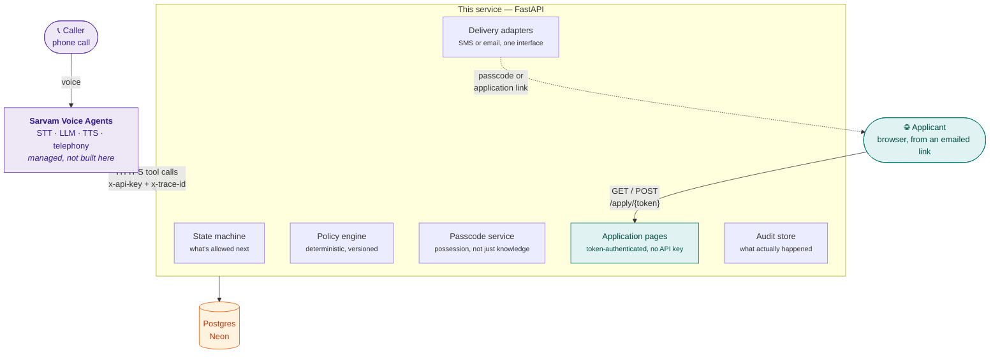
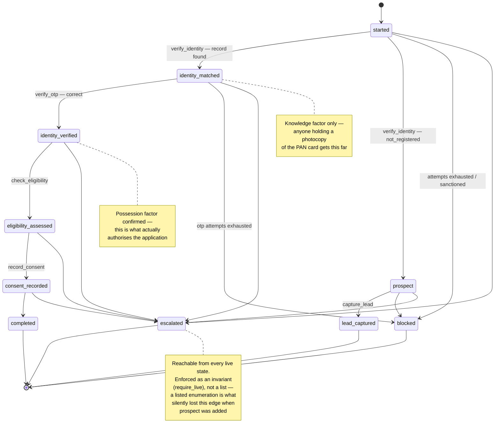

# Architecture

## Shape of the system

## Division of responsibility

The split is the central design decision. The model is good at conversation and
bad at guarantees, so it owns conversation and nothing else.

| Concern | Owner | Why |
| --- | --- | --- |
| Turn-taking, interruption, speech | Sarvam platform | Solved infrastructure; rebuilding it adds no value here |
| Wording, tone, language switching | Model | This is what it is genuinely good at |
| Which tool to call, and when to give up | Model, guided by prompt | Judgement under ambiguity |
| Whether that call is *allowed* | This service | Guarantees cannot live in a prompt |
| Credit decisions and terms | This service | Must be deterministic, versioned, defensible |
| Attempt limits, passcode policy, consent evidence | This service | Regulatory artefacts, not conversational state |

The rule of thumb: if getting it wrong would be a compliance incident rather than
an awkward sentence, it does not live in the prompt.

## The state machine

`app/models.py` defines `SessionState` and an explicit transition table. Every
tool call passes a state guard before doing work.

Two things this diagram makes visible that the transition table alone does not.

**Every live state has an edge into `escalated`.** That is not incidental — it is
the one property the diagram is drawn to prove. When `prospect` was added to the
machine, the escalation endpoint enumerated its permitted states and silently
lost the edge from the new one; a caller with no account who then asked for a
human would have been refused. The fix expresses the property structurally
(`require_live` rejects only terminal states) rather than as a list, and this
diagram is what a reviewer can check it against without reading the transition
table.

**`identity_matched` and `identity_verified` are drawn as genuinely different
states, not two labels on one step.** The first proves the caller knows what is
printed on a PAN card. The second proves they hold the phone or inbox the
system already trusts. `eligibility_assessed` has no edge from
`identity_matched` — a model that treats a located record as a verified caller
is refused by the machine itself (S19).

**Ordering is enforced, not requested, everywhere else too.** Models skip steps
under pressure from a caller, lose track across long calls, and can be talked
into "just this once". Scenarios S10 and S11 exercise consent before
verification and writing after a hand-off; both are refused with a 409 and a
recoverable message, so the call continues gracefully rather than crashing.

## The two identity paths

An unknown PAN is not a failed verification. Returning "that does not match our
records" to someone with no account tells a prospective customer they got their
own details wrong, and burns a verification attempt for something they did not
do. `not_registered` is therefore a distinct outcome from `retry`, and it opens
an acquisition branch instead of another attempt.

Leads are stored in their own table, never in `customers`. Writing an unverified
person into the customer table would let the *next* call find the record, treat
self-asserted details as established, and send a passcode to an address the
caller themselves chose — converting "I typed my own email" into "the registered
contact confirmed it". Separate tables make that impossible rather than
discouraged, and the machine keeps the paths apart in both directions: a prospect
cannot reach a credit decision (S24), and a located record cannot be diverted
into lead capture.

## Passcode design

`app/services/otp.py` owns the whole lifecycle rather than delegating to a
vendor's turnkey verification widget, because the policy limits are the
interesting part and they belong with the rest of the policy.

- Codes are stored as salted SHA-256 digests, never in plaintext, so a database
  disclosure yields nothing replayable.
- A challenge is single use: `consumed_at` is set on first success, so a code
  overheard on a recorded line cannot be reused.
- Expiry, verification attempts and resends are all capped.
- Issuance is rate limited **per customer, not per session**. Sessions are free
  to create, so a per-session cap would be no cap at all — an attacker could use
  the agent to flood a stranger's phone.

The passcode never appears in `agent_message`, so the model cannot read it aloud
even by accident. In demo mode it appears in `data.demo_otp`, which the response
template does not forward to the model.

## Delivery adapters

`sms.py` and `email.py` implement the same shape: take the code and its lifetime,
never a rendered message. That is deliberate for India — DLT means commercial SMS
is sent as a registered template id plus variables, so an interface accepting
finished text could not talk to MSG91 without unpicking it again.

`IssueResult` carries both a masked phone and a masked email and populates only
the one the active channel used, so the response layer phrases the message
correctly without knowing which provider ran. Retry budgets are tight on both —
three second timeout, one retry, worst case inside the platform's ten second tool
timeout, because a customer is on the line while it runs. A 4xx never retries: a
bad template or an unverified recipient will not fix itself.

SMS requires DLT registration as a business, which an individual developer cannot
complete; email requires only an API key. Both are built and tested, and
`OTP_DELIVERY_CHANNEL` selects between them.

## Why the policy engine is deterministic

`app/services/eligibility.py` is pure functions over a customer record. No model
call, no randomness, no network. Given the same inputs it returns the same
decision, and every decision carries:

- an explicit `reasons` list, not a score
- a `policy_version`, so a decision made last month can be explained with last
  month's rules

`referred` is a first-class outcome. Anything the rules cannot settle cleanly —
notably a declared income that diverges sharply from the record — goes to a human
rather than being forced into an approval or a decline.

## Request lifecycle

1. `TracingMiddleware` adopts the platform's `x-trace-id` or mints one, and
   starts the latency timer.
2. `require_api_key` checks the shared secret in constant time.
3. Pydantic validates the payload. A failure returns `outcome: "retry"` naming
   the offending field and its acceptable range in speakable wording, so the
   agent asks for the right thing rather than retrying the same value.
4. The handler loads the session, **checks for a replay, then guards the state**,
   and delegates to a service.
5. `_finalize` writes the audit row, commits, and returns.

Step 4's ordering is load-bearing; see below.

## Five bugs, and what each one changed

**Writes were not durable when the agent was told they were.** The session
committed in FastAPI's dependency teardown, which runs after the response reaches
the caller. A fast agent could issue its next tool call against state the
previous one had not committed. Fixed by committing inside `_finalize` before
returning, with `uq_tool_idempotency` as a backstop for genuinely concurrent
retries and a savepoint so a collision cannot poison the surrounding transaction.

**The replay check ran after the state guard.** A hand-off that succeeded and
then timed out would be retried against a session it had already moved to a
terminal state, and rejected as out-of-order — breaking the exact case
idempotency exists to handle. The general rule for a retry-safe handler:
*identify the request, check whether it already happened, then check whether it
is allowed.*

**A computed value was never persisted.** The monthly instalment was calculated
correctly, returned correctly, spoken correctly, and stored as zero, because the
column did not exist and the audit endpoint hard-coded it. Every test passed:
each layer only ever checked what the service *said*, never what it *wrote*. The
harness now cross-checks the durable record against the live responses after
every scenario.

**A rejection the agent could not act on.** A live call failed when a caller
asked for a ten year tenure: the schema capped it at seven and returned a generic
"I did not catch that" naming no field. The agent retried the same rejected value
and escalated a call that never needed a human. Validation errors now name the
field and its range, and a test fails if a new constrained field arrives without
recovery wording.

**A new state silently lost escalation.** Adding `prospect` removed the hand-off
from it, because the endpoint enumerated permitted states rather than expressing
the invariant. Now `require_live` rejects only terminal states, and a test
asserts escalation reaches every live state in the machine.

Three of the five were found by the scenario harness, one by review, and one by a
real conversation. Each fix generalised past its trigger.

## Observability

One structured JSON line per event, with `trace_id` and `session_id` on every
line. PAN, phone and email are masked at the point of logging, not at ingestion,
so an unredacted value never reaches disk.

`GET /v1/sessions/{id}` returns the redacted, replayable record of a call: the
tool sequence with per-call latency, passcode challenges (issued, attempted,
consumed — never the code), the eligibility decision with reasons, consent
records, any lead, and any escalation. It serves support and evaluation equally,
and the harness's audit cross-checks read from it.

## Data model

- **Reference data** (`customers`) stands in for core banking or a CRM.
- **Prospects** (`leads`) are deliberately separate: stated, not verified.
- **Audit data** (`onboarding_sessions`, `tool_calls`, `otp_challenges`,
  `eligibility_assessments`, `consent_records`, `escalations`) is append-only by
  convention. Consent and escalation rows are never updated or deleted.

## Deployment notes

SQLite is the default so the service runs with no infrastructure. It is adequate
for a single-instance demo and inadequate for production: concurrent writers
serialise, and the file does not survive a container restart on ephemeral
storage.

Moving to Postgres is a `DATABASE_URL` change. The data access layer is plain
SQLAlchemy 2.0 with no SQLite-specific SQL; the only conditional code is the
pragma listener in `app/db.py`, which no-ops on other backends.

Alembic owns the schema. `init_db` still exists for tests and scratch databases,
but it can only create tables, never alter them, which is precisely how three
schema additions each ended up needing manual repair during development. Every
deploy runs `alembic upgrade head`, and CI fails the build when a model change is
committed without a matching migration — the drift that otherwise leaves a
deployed schema quietly stale.

The switch became necessary rather than merely correct once the data had to
outlive a restart. An application link is valid for 48 hours; on ephemeral
storage a wipe between sending the email and the applicant opening it kills a
perfectly good link, so the link flow cannot be built on SQLite-on-a-container.
